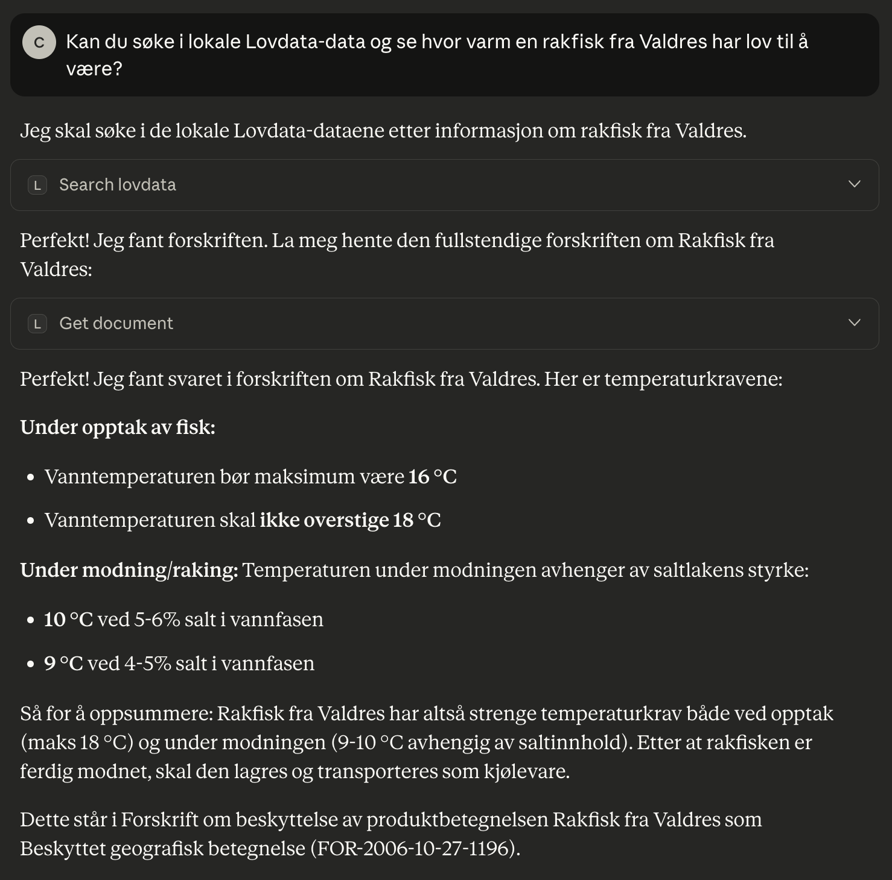

# lovdata2

This tiny hobby project contains:
* A rapid [API prototype](#api)
  showing how the Lovdata API might look if redesigned according to modern REST best practices.
* A [MCP server example]() of how to search the local content with Claude desktop

The repository also includes tools for downloading and processing Lovdata’s publicly
available datasets. These scripts generate a simplified, machine-readable dataset without
Lovdata’s editorial markup, suitable for research, indexing, or experimentation with
alternative API designs.

## API

The goal is to illustrate how Norwegian laws and regulations could be exposed through a
clean, predictable, developer-friendly REST interface.
ReDoc version of the OpenAPI specification: https://cloveras.github.io/lovdata2/api.html

It is not the official Lovdata API — see the real version here:
https://api.lovdata.no/swagger

### Workflow

Scripts to retrieve and process the public Lovdata datasets:

* [scripts/download_raw.py](scripts/download_raw.py) — Downloads the official Lovdata tarballs (laws and central regulations) into raw/.
* [scripts/prepare_xml.py](scripts/prepare_xml.py) — Extracts, normalizes, and pretty-prints the raw XML into xml_pretty/ for parsing.
* [scripts/build_dataset.py](scripts/build_dataset.py) — Builds HTML, Markdown, and JSON versions and generates cleaned metadata for local use and tooling.

## MCP Integration

Lovdata2 includes an example of a local MCP (Model Context Protocol) server so you can use
Claude Desktop to interactively query your private Lovdata dataset.

This provides a chat interface where Claude can:

* Search across all Norwegian laws & regulations locally
* Retrieve any law or forskrift by ID
* Extract a specific section (e.g., “§ 1”) from any document
* Get summaries or explanations of laws and sections

See the full MCP setup instructions: [README-mcp.md](README-mcp.md)

Here is one example of using Claude with the local MCP and dataset:

